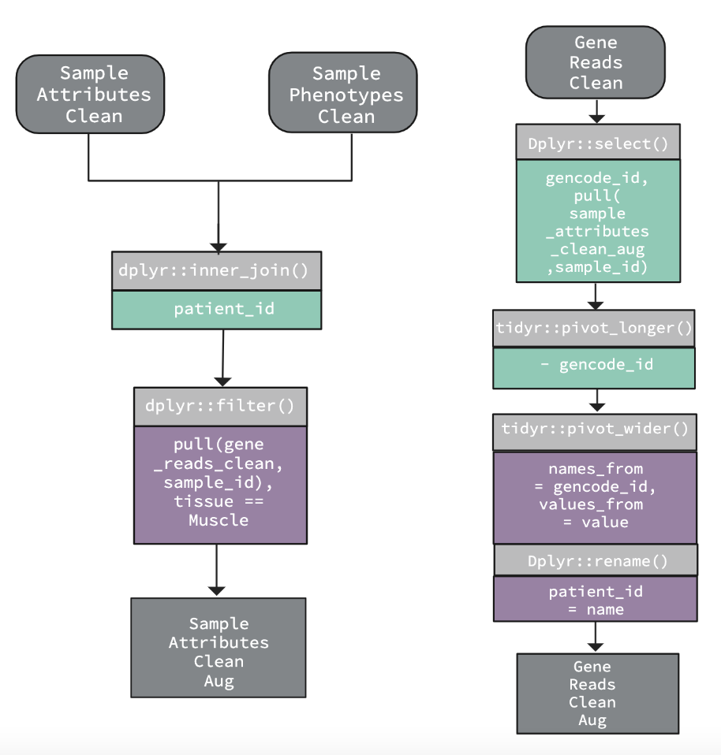

## Introduction

<div style="float: left; width: 40%;">
<font size="3">
- Is there a difference in gene expression between male and female muscle tissue?
  - Data from the Genotype-Tissue Expression (GTEx) data base.
  - Focus on the expression of 20,000 genes. 
  - Difference in cause of death and age (see figure).
</font>
</div>

<div style="float: right; width: 60%;">
```{r, echo=FALSE, out.width="80%", out.height="50%"}
knitr::include_graphics("../results/data_distributions.png")
```
</div>

## Material and Methods: Data files and analyses
<font size="3"> 
**File descriptions**

- 3 files from GTex Portal (open source):

  - Subject phenotype file: attributes of the subjects (Age and gender).
    
  - Sample attribute file: sample ID, tissue type, RIN number etc.
    
  - Gene counts file: Each row is a gene, each column is a sample from a patient. The cell value is the gene expression.

**Description of analyses**

- Principal Component Analysis
  - Reduce data dimension from 20,000 to 2
  - Look for initial signs of data clustering
  
- DESeq2
  - Calculate the log2fold change in gene expression between classes
  - Classes: male and female
</font>

## Material and Methods - Cleaning the data 

<div style="float: left; width: 40%;">
<font size="3"> 
**No. of rows x no. of columns before cleaning**

- Subject phenotypes: 980 x 4

- Sample attributes: 22951 x 63

- Gene reads: 500 x 9112

**No. of rows x no. of columns after cleaning**

- Subject phenotypes: 980 x 4

- Sample attributes: 9111 x 8

- Gene reads: 499 x 9112

</font>
</div>

<div style="float: right; width: 60%;">
```{r, echo=FALSE, out.height="30%"}

```
</div>

## Material and Methods - Augmentation

<div style="float: left; width: 40%;">
<font size="3"> 
**No. of rows x no. of columns before cleaning**

- Subject phenotypes: 980 x 4

- Subject attributes: 22951 x 63

- Gene reads: 500 x 9112

**No. of rows x no. of columns after cleaning**

- Subject phenotypes: 980 x 4

- Sample attributes: 524 x 11

- Gene reads: 524 x 500

  -> There are 524 patients in the final data
    
</font>
</div>

<div style="float: right; width: 60%;">
```{r, echo=FALSE, out.height="30%"}

```
</div>

## Results - PCA 


## Results - Volcano Plot

```{r, echo=FALSE, out.width="80%", out.height="50%"}
knitr::include_graphics("../results/deseq2_volcano_plot.png")
```

## Results - Heatmap


## Discussion

- Variance between samples (Age and cause of death)
  - We did not take this into account
  - Therefore, results are likely not replicable with new data. 
  
- Project is reproducible
  - Data and pipeline available on GitHub

## Conclusion

- PCA: blabla
- DESeq2
  - Volcano plot: Several genes are differentially expressed. 
  - Heatmap: We did not see as clear a difference as we had expected, but there were some visible differences. 
  

